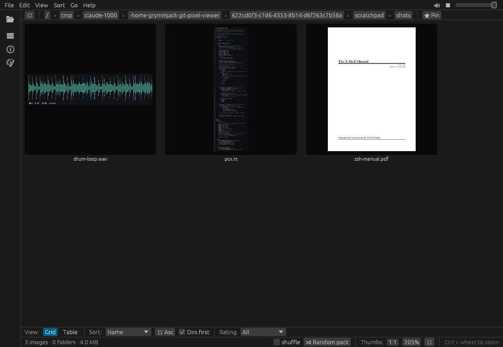
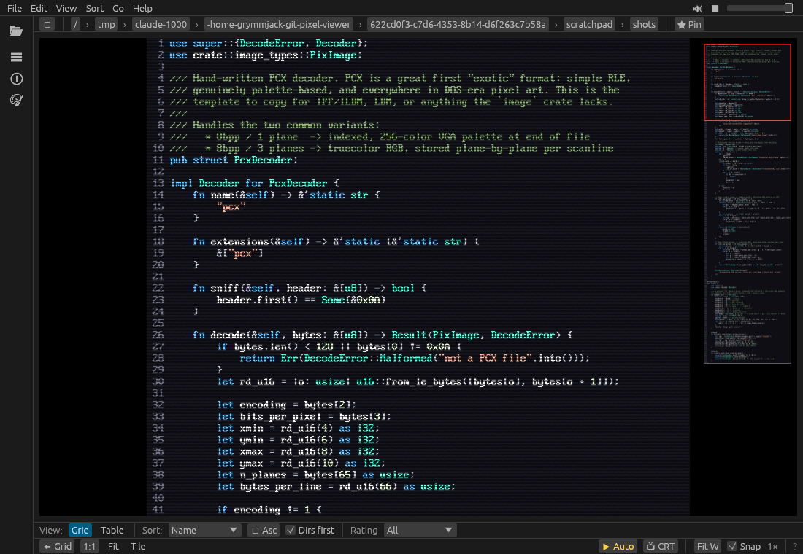
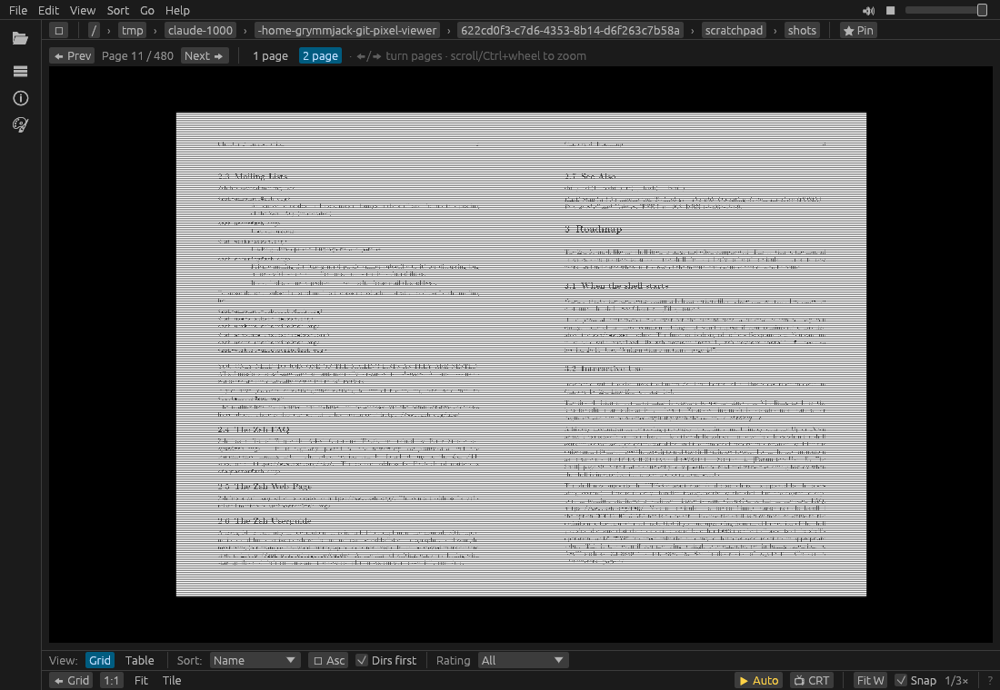
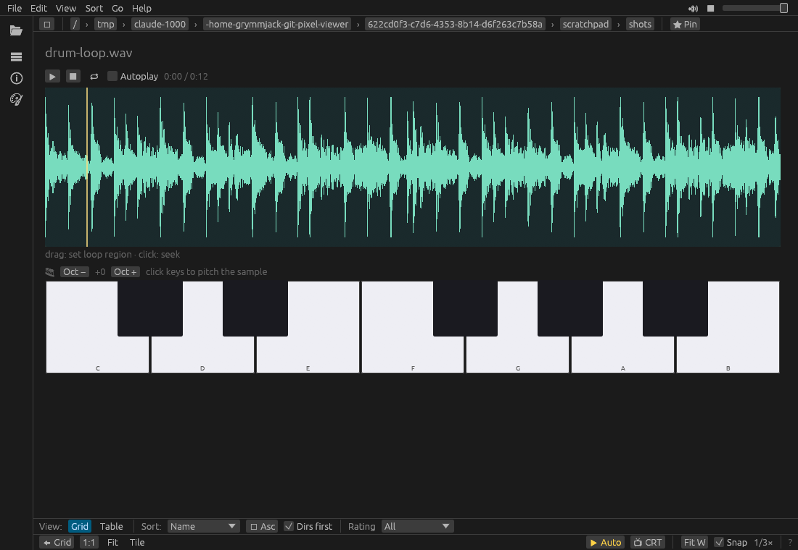
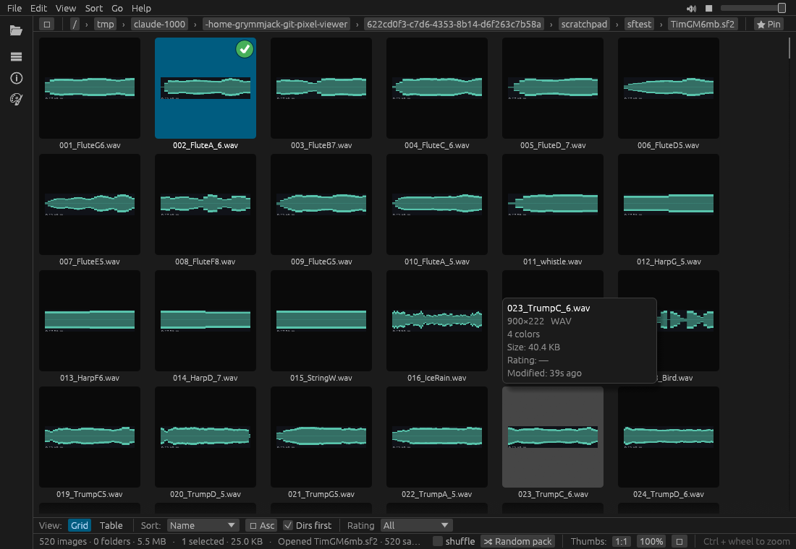
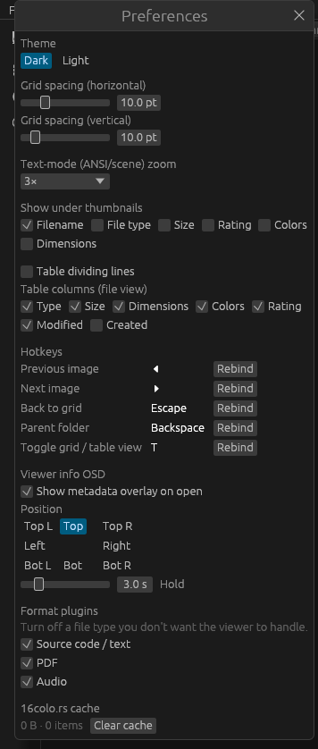

# pixel-viewer

A fast, **pixel-art-first** image **browser** for Linux/macOS/Windows, written in
Rust with [egui/eframe](https://github.com/emilk/egui). 

> I wrote this to accompany my https://github.com/grymmjack/pixelmon so I could easily see my generated AI art and rate it fast.
> Needless to say, things got a little...


It decodes everything from PNG and Photoshop files to Commodore PETSCII and EGA
vector RIPscript, browses inside archives (`.zip`/`.lha`/`.arj`/…), and can mount
[16colo.rs](https://16colo.rs) — the online ANSI archive — as a virtual folder.


Think *Gwenview for pixel art and the BBS scene*: crisp nearest-neighbor zoom, palette-preserving decoders,
a virtualized thumbnail grid, and first-class support for ANSI / PETSCII / RIPscript
and the rest of the demoscene / textmode art world — right down to baud-rate
"watch it type" playback and CRT effects.

---

## Table of contents

- [Highlights](#highlights)
- [Supported formats](#supported-formats)
- [Install & build](#install--build)
- [Quick start](#quick-start)
- [Feature tour](#feature-tour)
  - [Browsing & navigation](#browsing--navigation)
  - [The thumbnail grid](#the-thumbnail-grid)
  - [The single-image viewer](#the-single-image-viewer)
  - [Pixel-perfect rendering](#pixel-perfect-rendering)
  - [Recolor / colorizer pane](#recolor--colorizer-pane)
  - [Palettes](#palettes)
  - [Star ratings](#star-ratings)
  - [Search & smart filters](#search--smart-filters)
  - [File operations](#file-operations)
  - [Open in… (external program associations)](#open-in-external-program-associations)
  - [Source code, PDF & audio (plugins)](#source-code-pdf--audio-plugins)
  - [Archives & 16colo.rs](#archives--16colors)
  - [Scene art, ANSImation & retro effects](#scene-art-ansimation--retro-effects)
  - [Animated GIFs](#animated-gifs)
- [Keyboard shortcuts](#keyboard-shortcuts)
- [Command-line options](#command-line-options)
- [Menu reference](#menu-reference)
- [Settings & where things are stored](#settings--where-things-are-stored)
- [Bundled palettes](#bundled-palettes)
- [Architecture](#architecture)
- [Development](#development)
- [Credits](#credits)
- [License](#license)

---

## Highlights

- **30+ image & scene-art formats**, including palette-preserving PCX, Aseprite,
  PSD, GIMP XCF, SVG, and the full demoscene/textmode set (ANSI, XBin, PETSCII,
  RIPscript, and more).
- **Pixel-perfect zoom** — nearest-neighbor textures, snapped to whole device
  pixels so dithering never warps, even on fractionally-scaled (HiDPI) displays.
- **Virtualized thumbnail grid** — *or a sortable table view* — that scrolls smoothly
  through folders of thousands of images, with independent Ctrl+wheel tile sizing and
  configurable captions.
- **Recolor pane** — a fully reorderable pipeline: adjustments
  (brightness/contrast/gamma/hue/vibrance/posterize/invert/…), per-axis **pixelate**,
  palette rematch, **reduce-to-N** (on any image), **dithering** (with a zoomable,
  per-axis cell + Auto-detect), **resize/resample** with **pixel-art upscalers**
  (Scale2x/3x, Eagle, xBR, HQx, 2xSaI…), and bakeable **CRT post-FX**
  (scanlines / glow / vignette / phosphor). Save the whole stack as a named
  **PixelFX preset** and re-apply it in one click — and it all works on 16colo.rs art too.
- **A library of 55 bundled palettes** (CGA, EGA, VGA, Game Boy, NES, C64, PICO-8,
  DawnBringer, Endesga, …) plus `.GPL` import/export.
- **Beyond images** — view **source code** (~90 languages, syntax-highlighted), **PDFs**
  (real rendered pages + a 1-/2-page viewer), and **audio** (an in-app waveform player with
  looping, a piano-key sampler playable from a **hardware MIDI controller**, tracker-module
  playback with a per-sample explorer/export, and **sample banks — SoundFont / SFZ / DLS —
  browsed as a folder** of their samples). Each is a **toggleable plugin** you can switch off in
  Preferences.
- **Star ratings** stored as KDE Baloo xattrs (interoperate with Gwenview), with a
  cross-platform sidecar so even art inside a zip or on 16colo.rs is ratable.
- **A fading metadata OSD** in the viewer — title, artist(s), SAUCE comment and
  attributes — with clickable links that jump to the artist / group / pack on 16colo.rs.
- **View-history tracking** — visited pieces get a browser-style "you've seen this"
  link colour / check badge, plus view count and last-viewed in the Details pane.
- **Recursive advanced search** (name / type / dimensions / size / date / rating /
  SAUCE text) on a background thread, plus saveable "smart filters."
- **Browse archives and the online ANSI scene** as if they were folders — including
  flattening a 16colo.rs **artist / group / search** into a sortable table of individual
  pieces, backed by a persistent on-disk cache.
- **The BBS aesthetic, faithfully**: SAUCE-aware textmode rendering with true 24-bit
  color, authentic IBM VGA & C64 fonts, baud-rate ANSImation/RIP playback, CRT scanlines,
  phosphor glow, 9-dot VGA cells, slideshow, an immersive fullscreen mode, and a
  random-pack screensaver.

---

## Supported formats

Files are recognized by **content (magic bytes) first, then extension** — so a
mislabeled file still opens if its header is known. A folder listing is filtered
down to the extensions a decoder claims.

### 🖼 Images

| Category | Formats | Notes |
|---|---|---|
| **Raster** | PNG, GIF, BMP, JPEG, WebP, TGA, TIFF, PNM/PBM/PGM/PPM, QOI, **ICO** | Via the `image` crate |
| **Palette-preserving** | **PCX** | Original indices + palette kept, not flattened |
| **Layered / editor** | **Aseprite** (`.aseprite` / `.ase`), **Photoshop PSD**, **GIMP XCF** | Composited / flattened |
| **Animation** | Animated **GIF** | Plays in the viewer; hover-to-play in the grid |
| **Misc** | **.draw** (DRAW project) | PNG preview |

### ✒️ Vector

| Category | Formats | Notes |
|---|---|---|
| **Vector graphics** | **SVG** | Rasterized via resvg |
| **BBS vector** | **RIPscript** (`.rip`) | 640×350 EGA, hand-rolled BGI rasterizer + baud "watch it draw" |

### 🅰 Text-mode & scene art

| Category | Formats | Notes |
|---|---|---|
| **ANSI / ASCII art** | `.ans` `.asc` `.nfo` `.diz` `.ice` `.cia` | CP437 + ANSI SGR/cursor, iCE colors, 24-bit, SAUCE-driven cells, baud ANSImation |
| **Binary scene art** | **XBin** (`.xb`/`.xbin`), **raw BIN** (`.bin`), **TundraDraw** (`.tnd`, 24-bit), **iCE Draw** (`.idf`), **Artworx** (`.adf`) | |
| **Commodore** | **PETSCII** (`.seq`/`.pet`), **petmate** (`.petmate`) | Authentic C64 font + VIC-II palette |

### 📄 Documents & code *(plugins)*

| Category | Formats | Notes |
|---|---|---|
| **PDF** | `.pdf` | Real first-page tile + in-app 1-/2-page viewer (needs poppler) |
| **Source code / text** | ~90 exts — `rs` `c`/`cpp`/`h` `py` `js`/`ts` `css` `html` `php` `lua` `asm` `gd` `bas` `json` `yaml` `xml` `md` `log` `sh` `rb` `go` `swift` `kt` `ipynb` … | CP437-rasterized with a hand-rolled syntax highlighter + line numbers |

### 🔊 Sound *(plugin)*

| Category | Formats | Notes |
|---|---|---|
| **Sampled audio** | `mp3` `wav` `ogg`/`oga` `flac` `ape` `mka` | In-app player: interactive waveform, loop/seek, sampler keyboard, MIDI-in |
| **Other (external)** | `voc` `au` `snd` `aiff`/`aif` `m4a` `aac` `opus` `wma` `ra` | Music-note tile + "open in default app" |

### 🎵 Music — synthesized & tracked *(plugin)*

| Category | Formats | Notes |
|---|---|---|
| **MIDI** | `mid` `midi` `kar` `rmi` | Synthesized through a General MIDI **SoundFont** (rustysynth) |
| **AdLib / OPL** | **RAD** (`.rad`) | **OPL3 FM synthesis** — built-in OPL3 emulator + RAD replayer |
| **Trackers** | `mod` `xm` `s3m` `it` | Full-song playback (xmrs) + per-sample explorer/export |
| **Trackers (more)** | `669` `far` `okt` `med` `amf` `ult` `mtm` `stm` | Played via bundled **libxmp** (compiled from source) |

### 🎹 Instruments & sample banks *(plugin)*

| Category | Formats | Notes |
|---|---|---|
| **Sample banks** | **SoundFont** (`.sf2`), **SFZ** (`.sfz`), **DLS** (`.dls`) | Browsed as a folder of their samples; presets/instruments/sample counts |
| **Instruments** | **FastTracker II** (`.xi`), **Renoise** (`.xrns` song / `.xrni` instrument) | Browse + play + export the samples inside |

### 🗜 Archives & online

| Category | Formats | Notes |
|---|---|---|
| **Archives (virtual folders)** | `.zip` `.7z` `.rar` `.lha`/`.lzh` `.tar`/`.tgz`/`.tbz` `.ace` `.arj` `.arc` `.zoo` `.ha` `.uc2` `.sqz` `.hyp` | Browsed read-only; contents extracted on demand |
| **Online archive** | **[16colo.rs](https://16colo.rs)** | The ANSI scene, mounted as a virtual disk (years / packs / artists / groups / search) |

Scene-art formats are decoded with **SAUCE** metadata awareness (the standard
trailer ANSI artists use to record title/author/group/dimensions), shown in the
**Details** pane. The last three rows — **source code, PDF and audio** — are
[**toggleable plugins**](#source-code-pdf--audio-plugins) you can switch off in Preferences.

---

## Install & build

You need a [Rust toolchain](https://rustup.rs) (stable).

```sh
git clone <this-repo>
cd pixelview
cargo run --release      # build + launch (release is recommended: nearest-neighbor
                         # rendering wants the GPU/wgpu path)
```

Or build the binary and run it directly:

```sh
cargo build --release
./target/release/pixelview --folder ~/Pictures
```

### First-time system dependencies (Debian/Ubuntu/KDE)

```sh
sudo apt-get install libxcb-render0-dev libxcb-shape0-dev libxcb-xfixes0-dev \
                     libxkbcommon-dev libssl-dev libasound2-dev
```

`libasound2-dev` (ALSA) is needed **at build time** for the in-app audio player (rodio →
cpal → ALSA). The audio device itself is opened lazily and fallibly, so a headless box still
builds and runs fine. For **PDF rendering**, install **poppler** (`poppler-utils` — provides
`pdftoppm`) at runtime; without it, PDFs still show metadata and a labeled placeholder tile.

The build also **compiles the bundled [libxmp](https://github.com/libxmp/libxmp)** (MIT, vendored
under `vendor/libxmp`) from source for the extra tracker formats — this needs only a **C compiler**
(the one you already have for the ALSA/SQLite deps); there's no `libxmp` package to install.

eframe uses the **wgpu** backend by default — that's what gives the pixel-perfect
nearest-neighbor textures, and it runs fine on KDE Plasma 6 / Wayland.

### Desktop icon (Linux)

To register a real application icon and `.desktop` entry (so KDE/Wayland shows a
proper task-switcher icon), run:

```sh
./install-icon.sh
```

It installs `pixelview.desktop` + the app icon into `~/.local/share`. The entry's
`StartupWMClass=pixelview` matches the window's app-id so the icon maps correctly.

---

## Quick start

1. Launch `pixelview` (optionally with `--folder PATH`).
2. The **thumbnail grid** shows the current folder. Click a folder tile to descend,
   or use the breadcrumbs / **Go** menu / `Backspace` to go up.
3. **Click an image** to open the single-image viewer. `←` / `→` step through the
   folder; `Esc` returns to the grid.
4. **Ctrl + mouse-wheel** resizes thumbnails in the grid, or zooms the image in the
   viewer. In the viewer, **hold `Z` + a digit** jumps to an exact zoom.
5. Press **`/`** to filter the grid by filename, or **Ctrl + F** for full recursive
   search.
6. **1–5** rate the current image (`0` clears), drag favorites into the toolbar, and
   open the **Recolor** pane (View menu) to remap palettes.

Everything you change — zoom, thumbnail size, theme, favorites, last folder, sort
order, CRT toggles, baud rates — is **remembered between runs**.

---

## Feature tour

### Browsing & navigation

- **Breadcrumb path** with clickable segments, plus a current-path bar.
- **Drag-reorderable favorites** in the top toolbar — drag to rearrange,
  right-click to remove, or pin any folder via its grid context menu / the **Go**
  menu. `🏠 Home` and `⬆ Up` are always available. **Color-tag** any favorite from its
  right-click menu (an ANSI32 swatch grid) to fill the button with a color. To keep the
  top bar uncluttered it shows **only color-tagged favorites** by default (toggle in
  **View → Favorites bar: colored only**); the rest stay in the Places dock, and a `+N`
  marker notes how many are hidden.
- **Places dock** with **Local** / **PixelFX** / **16colo.rs** sub-tabs (plus **Kits** /
  **Samples** with the audio plugin) — local holds Home, your on-disk favorites and saved
  smart filters; **PixelFX** holds your saved recolor-stack presets; 16colo.rs holds the
  🌐 browse entry and your remote pins (e.g. a pinned artist that re-runs its search on click).
- **Left activity rail** (VSCode-style) of icon toggles for the docks.
- **Explorer dock** — an expandable, lazy-loading folder tree with a filter box
  (collapsed nodes do no disk I/O).
- **Details dock** — a live fit thumbnail of the selection, its metadata, palette
  swatches, and a `.GPL` palette export button.
- **Mouse back/forward buttons** navigate folder history in the grid, or step
  images in the viewer.

### The thumbnail grid

- **Virtualized** — only the visible rows are ever built, so a folder with tens of
  thousands of files stays responsive.
- **Background thumbnailer** — N worker threads (one per core) decode + scale off
  the UI thread; the most-recently-scrolled-into-view tiles are prioritized.
- **Independent tile sizing** via **Ctrl + wheel** (separate from the UI zoom).
- **Configurable captions** — choose which fields show under each tile (filename,
  dimensions, size, …) and how many lines, with independent horizontal/vertical
  grid spacing (Preferences).
- **Folder tiles** render a **montage** of the images inside them, plus a count
  badge — recursively.
- **Multi-select** with Ctrl+click (toggle) and Shift+click (range); `Home`/`End`
  jump to the first/last item.
- **Grid or Table view** — toggle with **`T`**, the **View** menu, or the button in the
  sort bar (persisted). The table is a hand-rolled, virtualized, sortable list: click a
  header to sort (click again to reverse), **right-click** a header to sort or show/hide
  columns, **drag a column border** to resize, and **drag a header** to reorder. The same
  selection, ratings, keyboard nav and context menu work in both views. Rows are
  zebra-striped; optional **dividing lines** (Preferences → *Table dividing lines*) add a
  subtle row/column grid.
- **View history** — once you've opened a piece it's marked visited: a **painted check
  badge** on its tile (and a browser-style "visited link" colour in the table). View count
  and last-viewed show in the Details pane; right-click → *Mark as (not) viewed* to override.

### The single-image viewer

- **Nearest-neighbor zoom** with drag-to-pan, and a minimap/navigator on huge
  images.
- **Two zoom modes:** raster art keeps a logical `%` zoom remembered across images;
  textmode/scene art uses **device-pixel scale** (`N×`) so it stays crisp on HiDPI. The
  scale ladder is integer both ways — `N×` zooming in, **`1/N×` zooming out** — so a big
  or very tall scene can shrink right down to fit (downscaling is smoothly area-averaged,
  not aliased).
- **Fit to window** (`F`) is sticky — toggle it on and every newly opened image
  auto-fits. **Fit W** re-fits to viewport width. **Tile preview** (`T`) fills the
  window with the tiled image for seamless-texture testing.
- **Huge images** beyond the GPU texture limit are uploaded as a tile grid and shown
  at full resolution.
- **Scroll a long image** with the wheel, the **`↑`/`↓`** arrows, **`Home`/`End`** (top /
  bottom), or **`PageUp`/`PageDown`** — a page is **25 lines** for scene art, just like an
  old 80×25 DOS screen.
- **Metadata OSD** — a fading info panel appears on each newly opened image (configurable
  position — any corner or edge — and hold time in Preferences). It shows a headline
  **title**, the **artist(s)**, the **SAUCE comment**, and an attributes row (type /
  columns / lines / font / group / pack / year / ★). **Hover it** to pin it open (it won't
  fade while you're on it); each artist / group / pack / year is a **clickable link** that
  jumps there on 16colo.rs (local paths jump to the folder); the **`×`** dismisses it for
  the current image.

### Pixel-perfect rendering

pixelview goes out of its way to keep pixel art *exact*:

- Source-resolution thumbnails and the viewer upload `NEAREST` textures so upscaling
  never smears.
- On **downscale**, thumbnails are **area-averaged** (box filter) instead of
  point-sampled — single-sampling a 50% dither would alias it into fake noise.
- For pixel-perfect modes the blit is **snapped to whole device pixels per source
  pixel and aligned to the device grid**, because fractional desktop scaling (e.g.
  1.3× HiDPI) would otherwise duplicate some source rows more than others and warp
  the dithering.

### Recolor / colorizer pane

A non-destructive image pipeline (View → Recolor pane) whose **stage order is fully
user-controlled** — drag the grip handle or use ⬆/⬇ to reorder *every* stage below,
including the effects:

- **Adjustment ops:** brightness, contrast, gamma, shadows, highlights, posterize,
  hue, saturation, **vibrance** (protects already-vivid colors), sharpen, and
  **invert** (blend toward negative for partial solarize).
- **Pixelate** — a mosaic block with independent **Width × Height** and a **Lock**
  (square by default), so blocks can be stretched, not just square.
- **Palette remap** — snap the image to any bundled or loaded palette.
- **Reduce** — quantize to N colors. Works on **any** image: if it has too many colors
  to extract a palette, one is synthesized from its pixels and reduced from there.
- **Dithering** — ordered/Bayer, an editable **custom matrix**, or error-diffusion
  (Floyd–Steinberg / Atkinson). Because dither is a separate stage, you can place it
  *before* posterize for dithered banding with no palette snap. The ordered patterns
  have an independent **Cell W × H** scale (+ Lock) so the crosshatch can be zoomed to
  read on hi-res art, and an **Auto** button that detects the art's pixel scale (or
  scales to the resolution) and matches the cell to it.
- **Color balance** — per-channel R/G/B offset from a picked color or hex value.
- **Resize / resample** — downsample the art to a fraction of native, run the whole
  pipeline at that lower resolution, then upscale back so it displays at the *same*
  on-screen size — to judge low-res degradation and dither at single-pixel scale.
  Width/Height sliders with a Lock, **Quick** 100/75/50/25 %, and `/2 · ×2 · ×¼ · ÷¼`
  steps. An **Upscale** dropdown runs a pixel-art scaling algorithm *first* (so the
  enlarged art flows through the whole stack + Save): **Scale2x/EPX · Scale3x ·
  Eagle 2×/3× · xBR 2×/3×/4× · HQ2x/3x/4x · 2xSaI · Super2xSaI · SuperEagle** — the
  smooth [pixel-art scalers](https://en.wikipedia.org/wiki/Pixel-art_scaling_algorithms)
  that enlarge sprites with edge-aware interpolation instead of blocky nearest.
- **CRT post-FX** (bake into the image, positionable anywhere in the stack):
  **Scanlines** (amount, spacing, horizontal `==` / vertical `||` / 45° diagonal
  `\\` `//` direction, and a tint color), **Glow** (phosphor bloom), **Vignette**
  (edge darkening), and **Phosphor** (an RGB aperture-grille mask).
- Live preview, with the result applied to grid tiles too (**Apply to grid**);
  **Export** the palette as `.GPL` or **Save** the recolored image.

**PixelFX presets** — save the *entire* recolor stack (adjustments + order, post-FX,
dither, color balance, resize, reduce, and the active palette) as a named preset in
the **Places → PixelFX** tab. Click to apply, right-click to rename, remove, or set a
background + text color (text auto-contrasts for readability). Build a library of
looks and slam any of them onto an image in one click.

The whole pipeline — adjustments, PixelFX presets, reduce, dither, post-FX — also
works while **browsing 16colo.rs** (both the details preview and *Apply to grid*).

### Palettes

- **55 palettes bundled into the binary** (no external files needed) — see the
  [full list](#bundled-palettes).
- Load your own `.GPL` files from a configurable palette directory (they *add* to the
  bundled set).
- Export any image's palette to `.GPL` from the Details or Recolor pane.
- Palette-based formats (PCX, etc.) **preserve their original indices + palette**, so
  recoloring and accurate re-export work on the real palette, not a guessed one.

### Star ratings

- **1–5** sets a rating, **0** clears it. In the grid/table the tile **under the cursor**
  is rated (so you can hover-and-rate quickly); in the viewer it rates the current image.
  Or right-click → **★ Rating** to pick from a menu (with the 0–5 hotkeys shown).
- Stored as the **KDE Baloo `user.baloo.rating` extended attribute** — the same
  scheme Gwenview uses, so ratings made here show up there (and vice-versa).
- A **cross-platform `ratings.json` sidecar** mirrors them, which is what makes art
  *inside a zip or on 16colo.rs* — which has no real on-disk file — ratable at all.
  The rating survives re-extraction because it's keyed by the stable display path.
- Sort or filter the grid by rating.

### Search & smart filters

- **`/`** — quick vim-style filename filter over the current folder.
- **Ctrl + F** — advanced **recursive search** across the whole subtree, on a
  background thread (cancellable, results stream in live). Filter by any combination
  of: filename, extension list, width/height min-max, file size, modified-date range,
  minimum ★, and SAUCE text. Result tiles show *where* each hit lives.
- **Smart filters** — save a search as a reusable named filter (e.g.
  `*.ans · sauce:acid`); they appear in the Places dock and re-run from the current
  folder on click.
- **Smart filter on…** — right-click any file to seed a fresh search from one of its
  attributes (its type, a word from its name, ±20% of its size, its date, its rating,
  or its SAUCE group/artist).

### File operations

Full file management, with **undo**:

- Copy / Cut / Paste, New folder, Rename, and **Move to trash** (via the system
  trash) — from the right-click context menu, the **Edit** menu, or shortcuts.
- **Ctrl + Z** undoes the last operation (trash restore, move-back, delete a created
  folder, or remove pasted copies).

### Open in… (external program associations)

Register your own editors and open files in them by type:

- Right-click a file → **Open in…** lists the programs registered for that extension
  (e.g. an `.ans` → Moebius / PabloDraw; a `.png` → GIMP / LibreSprite; an `.svg` →
  Inkscape), plus **Other program…** to pick one ad-hoc.
- Edit the list under **View → Associations…**: each association has a **name**,
  **program** (path or command, with a Browse button), **extensions** it handles,
  optional **arguments** (`{}` is replaced by the file path, otherwise it's appended),
  optional **environment** variables (`KEY=VALUE` per line), and an optional **icon**
  (shown in the menu). **Add preset** seeds common tools (GIMP, Inkscape, Aseprite,
  LibreSprite, Moebius, PabloDraw, …).
- Works on virtual art too: a 16colo.rs piece or a file inside an archive is launched
  from its real on-disk (downloaded/extracted) copy.

### Source code, PDF & audio (plugins)

pixelview isn't only for pixels. Three extra viewers let you browse a folder that mixes
art with **source code, PDFs and audio** — each shows a real thumbnail in the grid and
opens in a purpose-built viewer:



**Source code / text** — ~90 languages (`rs`, `c`/`cpp`, `py`, `js`/`ts`, `css`, `html`,
`php`, `lua`, `asm`, `gd`, `json`, `yaml`, `md`, `log`, Jupyter `ipynb`, …) are rasterized
with the CP437 font and a lean, hand-rolled syntax highlighter (comment/string/keyword
rules, a line-number gutter, tab expansion) — no heavyweight dependency. Press **Enter** to
open the file in its associated editor.



**PDF** — the grid tile is the **real first page** (rendered via poppler's `pdftoppm`; a
labeled placeholder if poppler isn't installed), and opening one enters an in-app viewer
with **Prev / Next**, a page counter, and a **1-page / 2-page spread** toggle (`←`/`→` turn
pages). Page count, size, and title/author come from the PDF's metadata.



**Audio** — `mp3` / `wav` / `ogg` / `flac` (and tracker modules `mod` / `xm` / `s3m` / `it`)
get a **waveform tile**, and opening one drops a full player into the viewer: an interactive
waveform (**drag** to set a loop region, **click** to seek, with a moving playhead), a
transport (play/pause, stop, loop, Autoplay), **Spacebar** play/pause, and an **onscreen
piano keyboard** that auditions the sample pitch-shifted across octaves. Master **mute /
stop / volume** controls also live at the far right of the menu bar.



The audio player goes further than playback:

- **Play from a hardware MIDI controller.** Pick a connected MIDI input device in the
  player's **MIDI in:** menu and its keys audition the loaded sample — pitched by note, with
  velocity as volume. The chosen device is remembered and auto-reconnects on launch.
- **Explore the samples inside a tracker module.** Open a `.mod` / `.xm` / `.s3m` / `.it`
  and every individual sample is listed below the keyboard. Click one to load it — the
  waveform, transport and keyboard all follow it — or **export it as a WAV**. A *Full song*
  row jumps back to the whole module.
- **Build a drum kit and export it to your DAW.** The big player has a **4×4 sample-pad grid**
  (a mini Battery): drop or load samples onto pads, map them to MIDI notes (or MIDI-learn from a
  hardware grid controller), and set per-pad volume, an Ableton-style **pan knob**, **pitch**, **loop
  points**, a **choke group** (1–8; a hi-hat idiom — triggering one pad silences the others in its
  group), an **amplitude ADSR envelope** (attack / decay / sustain / release), and velocity response.
  Save the working kit as a `.pvkit`, export every pad as a **zip of WAVs**, or export the whole
  thing as an **SFZ instrument** — a `.sfz` next to a `<name>_samples/` folder of 16-bit WAVs that
  loads in any SFZ-capable sampler or DAW (Bitwig, sforzando, TX16Wx, Kontakt via convert, …). Each
  pad becomes a mapped region carrying its note, volume, pan, pitch, loop (forward/reverse), choke
  group (`group`/`off_by`), amplitude envelope and velocity tracking — all native SFZ.
- **Shape envelopes right on the waveform.** Click **`e`** on a pad and pick a target from the
  **`Env:` selector — Amp · Pitch · Cutoff · Res**. Edit the ADSR **visually**: drag the round **node**
  handles (attack / decay+sustain / release) and the diamond **curvature** handles (bow each segment
  concave/convex). A **live playhead** sweeps across as the pad plays so you can see the modulation
  shape the sound, and an optional **BPM beat grid** snaps nodes to tempo. You can drag the **release
  end** node to gate the envelope (silence the tail), pick **preset shapes** (Pluck / Perc / Saw / Gate
  / Pad), and **save your own**. Each pad also has a built-in **low-pass filter** (cutoff + resonance)
  and a per-target **LFO** (tremolo / vibrato / filter wobble — sine · triangle · saw · square ·
  sample&hold, free-running or **tempo-synced**, with fade-in). A linear envelope exports as universal
  SFZ (`ampeg_*` / `pitcheg_*` / `fileg_*` + `cutoff`/`resonance`); a curved one exports as an SFZ v2
  **flex EG** (`egN_shape*`), and LFOs export as native `amplfo`/`pitchlfo`/`fillfo` — all read by
  ARIA-based samplers (sforzando, Bitwig).
- **Browse a sample bank as a folder.** A **SoundFont (`.sf2`)**, **SFZ (`.sfz`)**, **DLS
  (`.dls`)**, **FastTracker II instrument (`.xi`)**, or **Renoise song/instrument
  (`.xrns`/`.xrni`)** shows as an enterable "folder"; its Details pane reports what's inside
  (presets / instruments / regions / **sample count** + key range), and entering it lists every
  sample as a file you can play, audition on the keyboard/MIDI, rate, and export. (SFZ references
  external samples, so they're linked in place; SF2/DLS/XI embed their PCM, so those are extracted;
  `.xrns`/`.xrni` are ZIP containers whose `SampleData/` you browse directly. Full Renoise *song*
  playback is out of scope — this exposes the samples.)



- **Play MIDI files.** A `.mid` / `.midi` / `.rmi` is only note events, so it's **synthesized to
  audio through a General MIDI SoundFont** (auto-detected from your system, or pick one in
  Preferences → *MIDI SoundFont*) and plays in the full player — waveform, transport, keyboard and all.
- **Play RAD (Reality Adlib Tracker) modules.** `.rad` is **OPL2/OPL3 FM synthesis** (AdLib chip
  music, not samples), rendered by a built-in OPL3 emulator + RAD replayer — so those chiptunes
  play right in the app like any other audio.

Opening or revisiting audio is **cached** — a tracker or MIDI file that takes a moment to
synthesize is decoded once and cloned from memory on the next visit, so flipping back and forth is
instant.

**They're plugins — turn off what you don't want.** Source code, PDF and audio are each a
runtime **toggle** in **Preferences → Format plugins**. Switch one off and its file type
disappears from folder listings and is never decoded — so if you only care about pixel art,
you can keep the viewer lean.



> The three are otherwise ordinary files: **any** file also gets an **Open in default app**
> entry (xdg-open / open / explorer) in the right-click *Open in…* menu, the Details pane, and
> via **Enter** in the viewer — so anything the viewer doesn't render still drops into its OS
> default program.

### Archives & 16colo.rs

- **Archives as virtual folders** — open a `.zip` / `.lha` / `.arj` / `.arc` /
  `.zoo` / `.7z` / `.rar` / … and browse inside it; contents are extracted on demand
  to a temp dir.
- **[16colo.rs](https://16colo.rs) as a virtual disk** — a Places entry with a nav
  bar (Years / Latest / Groups / Artists, plus a facet-scoped Search). A **Year** lists
  **Packs**, and pack art is auto-downloaded and shown like any local folder.
- **Artist / Group / Search → a table of pieces** — instead of listing pack folders,
  these flatten to a **sortable table of individual artworks** (thumbnail · filename ·
  artist · type · year · group · pack), streamed from the JSON API with no pack download.
  Opening a piece grabs just its single file; the **Pack / Year / Group** cells are links
  into the browser; and a per-row **⬇ menu** saves the file or its whole pack `.zip` to
  disk. Pin an artist/group/search to Places to bookmark it.
- **Persistent on-disk cache** — JSON, thumbnails, downloaded files and pack zips are
  cached (SQLite-indexed, LRU-evicted, 2 GiB cap) so re-browsing doesn't re-fetch.
  *Preferences* shows the cache size and a **Clear cache** button.
- **PDF pieces** (e.g. ANSI-calendar releases) have no server-side render, so their
  first page is rendered locally (poppler) for the grid/table thumbnail.
- **The full Recolor pipeline works here too** — adjustments, PixelFX presets, reduce,
  dither and post-FX apply to a browsed piece's preview and (with *Apply to grid*) its
  tiles.

### Scene art, ANSImation & retro effects

The textmode/BBS side is the heart of pixelview:

- **Authentic fonts** — the real IBM VGA CP437 ROM (8×16 and an 8×8 VGA50 variant)
  and a C64 character ROM, so block/shade/line-draw glyphs are exact.
- **SAUCE-driven layout** — cell size (8×8 VGA50 / EGA43 vs 8×16), iCE colors, and
  canvas width come from the file's SAUCE record.
- **True 24-bit color** — full RGB ANSI (PabloDraw's `ESC[…t` sequences and SGR
  `38;2`/`48;2`) renders pixel-identical to ansilove, not snapped to the 16-color palette.
- **9-dot VGA cell** (toggle) — renders the 8-pixel glyph in a 9-wide cell the way
  real VGA text mode did (the 9th column repeats for line-draw chars so box rules
  join). This is why output matches ansilove / 16colo widths.
- **Baud-rate playback** — watch ANSI art and RIPscript *draw themselves* at an
  authentic modem speed (300 baud crawl → 115.2k). Pick a rate in the status bar; the
  view auto-scrolls BBS-style to follow the cursor. ANSI and RIP remember independent
  speeds. The binary formats (XBin/BIN/PETSCII/…) "type out" cell-by-cell. **Any input**
  (scroll, zoom, key) finishes the transmission instantly and hands you back the scroll.
- **CRT aspect** (toggle) — stretches textmode art ~1.2× vertically to match
  non-square VGA pixels (80×25 → 4:3). The horizontal axis stays pixel-perfect for crisp
  dithering; the stretch shows at every zoom (including fit-to-screen).
- **Phosphor glow** + **retro scanlines** (with adjustable darkness and a "scale with
  zoom" option) + optional **black background** — composable CRT-monitor effects.
- **Immersive mode** (`F11`) — OS fullscreen with every panel hidden; bars reveal
  when the mouse reaches a screen edge, and the cursor auto-hides after ~1.5s.
- **Slideshow** — auto-advance through a folder (1/3/5/10s), waiting for any baud
  transmission to finish first. Touch the keyboard or mouse and it **auto-pauses** (the
  `auto ▶` control turns yellow); click it to resume.
- **Random-pack screensaver** — `🔀 Random pack` (or **R**) jumps to a random
  16colo.rs pack; with Shuffle on it chains endlessly. Pair with `F11` for a
  screensaver of real scene art.

### Animated GIFs

Animated GIFs play in the viewer (autoplay + frame seek) and **play on hover** in the
thumbnail grid.

---

## Keyboard shortcuts

The four **navigation keys are rebindable** in **Preferences → Hotkeys** (press
*Rebind*, then the new key; `Esc` cancels). Their defaults:

| Key | Action | Where |
|---|---|---|
| `←` | Previous image | Viewer |
| `→` | Next image | Viewer |
| `Esc` | Back to grid | Viewer |
| `Backspace` | Parent folder | Anywhere |

The rest are fixed (this is the same list shown in **Help → Keyboard shortcuts**):

| Key | Action |
|---|---|
| `Ctrl +` / `Ctrl -` | Zoom the whole UI |
| `Ctrl + Wheel` / pinch | Resize thumbnails (grid) · zoom image (viewer) |
| `Wheel` | Viewer: previous / next image (or scroll a long one) · Grid: scroll |
| `↑` / `↓` | Viewer: scroll a long image |
| Mouse Back / Fwd | Grid: folder history · Viewer: prev / next image |
| `Home` / `End` | Grid: first / last · Viewer: scroll to top / bottom |
| `PageUp` / `PageDown` | Viewer: scroll 25 lines (a screen of scene art) |
| `/` | Grid: filter by filename |
| `Ctrl + F` | Open advanced recursive search |
| `Drag` | Pan the image (viewer) |
| `F` | Fit to window + auto-fit new images (viewer) |
| `T` | Grid/Table toggle (browse) · Tile preview — fill window (viewer) |
| `F11` | Immersive / fullscreen |
| `1` – `5` | Set star rating |
| `0` | Clear rating |
| `R` | Jump to a random 16colo.rs pack |
| `Enter` | Open the current file in its OS default app |
| `Space` | Play / pause the audio preview |
| `Click` | Open image / enter folder |
| `Ctrl + Click` | Toggle selection |
| `Shift + Click` | Range-select |
| `Right-click` | Grid: file-operations menu |
| `Ctrl + C` / `X` / `V` | Copy / Cut / Paste |
| `Ctrl + N` | New folder |
| `F2` | Rename |
| `Delete` | Move to trash |
| `Ctrl + Z` | Undo last file operation |

**Zoom chord (viewer):** hold **`Z`** and press a digit to jump to an exact zoom —
`1`–`9` = 100%–900%, `0` = 1000%. For textmode/scene art the digit means **device
pixels per source pixel** (e.g. `Z`+`3` = `3×`). `Z` + `+`/`=` and `Z` + `-` step the
zoom ladder. (Holding `Z` suppresses the `1`–`5` rating keys.)

---

## Command-line options

```
pixelview — a pixel-art-first image viewer

USAGE:
    pixelview [OPTIONS]

OPTIONS:
    -f, --folder <PATH>           Open this folder on launch
    -t, --thumbnail-size <SIZE>   Thumbnail tile size: a number (e.g. 160) or
                                  WxH (e.g. 120x160 — tiles are square, so the
                                  larger dimension is used)
    -h, --help                    Print this help
```

`--thumb-size` is accepted as an alias of `--thumbnail-size`. **Settings passed on
the command line override the persisted ones and are remembered afterward.**

---

## Menu reference

| Menu | Items |
|---|---|
| **File** | Open folder… · Quit |
| **Edit** | ↩ Undo · Copy · Cut · Paste · New folder · Rename… · Move to trash · Find images… (Ctrl+F) |
| **View** | Table view · Explorer pane · Details pane · Recolor pane · Reset thumbnail size · Associations… · Preferences… |
| **Sort** | Name · Type · Modified · Created · Size · Rating · Colors · Descending · Directories first |
| **Go** | ⬆ Up · 🏠 Home · *(your pinned favorites)* |
| **Help** | Keyboard shortcuts |

**Preferences** covers theme (Dark/Light), grid spacing, caption fields, table columns,
the default textmode zoom, the metadata-OSD position/hold, the rebindable **Hotkeys**,
the **Format plugins** toggles (source code / PDF / audio), the palette directory, and the
16colo.rs cache (size + Clear).

---

## Settings & where things are stored

- **Settings** persist via eframe's storage at `~/.local/share/pixelview/` (Linux).
  Each setting (zoom, thumbnail size, favorites, last folder, sort/filter, dock
  visibility, grid spacing, captions, keymap, CRT/baud/look toggles, …) is its own
  key.
- **Ratings** live in two places: the `user.baloo.rating` xattr on real files (for
  Gwenview interop) and a portable `ratings.json` sidecar in the data dir (for
  virtual art and non-Linux platforms).
- **View history** is a small SQLite database (`views.db`) in the data dir — visited
  state, view count, and first/last-viewed, keyed by the same stable display path.
- **The 16colo.rs cache** lives under `<data>/cache/` (blob files + a `cache.db` index);
  clear it from Preferences.
- **Palettes** are embedded in the binary; an optional user palette directory adds
  more `.GPL` files on top.

---

## Bundled palettes

55 `.GPL` palettes ship inside the binary (color count in parentheses):

```
1BIT (2)                 EGA (16)                 NES (55)
2BIT (4)                 ENDESGA-16 (16)          PICO-8 (16)
6BIT (64)                ENDESGA-32 (32)          PICO-8-SECRET (32)
AMSTRADCPC (26)          ENDESGA-36 (36)          PINEAPPLE-32 (32)
ANSI32 (32)              ENDESGA-64 (64)          QUAKE (244)
APPLE2-HIRES (6)         FAIRCHILD (8)            SECAM (8)
APPLE2-LORES (16)        FUNKYFUTURE (8)          SEGA (64)
ATARI-8BIT (256)         GAMEBOY (4)              SHOVEL-KNIGHT-NES (59)
ATARI2600 (128)          GAMEBOY-BGB (4)          SODA-CAP (4)
BBCMICRO (16)            HALLOWPUMPKIN (4)        SYNTHEWAVE-CITY (8)
BLOODMOON21 (9)          INK (5)                  TELETEXT (8)
C=64 (16)                INK-CRIMSON (10)         VGA (256)
CGA0/1/2-HIGH/LOW (4)    INTELLIVISION (16)       VINES-FLEXIBLE-LINEAR-RAMPS (38)
CGA32 (32)               JUNGLE-8 (8)             VIVIDMEMORY (8)
COLODORE (16)            MS-WINDOWS (16)          ZXSPECTRUM (16)
CYBERPUNK-NEONS (11)     MSX (16)
DAWNBRINGER-16 (16)
DAWNBRINGER-32 (32)
DAWNBRINGERS-8-COLOR (8)
```

Drop a `.GPL` into `assets/palettes/` (and add one `include_str!` line) to bundle a
new one, or point pixelview at a palette directory to load yours at runtime.

---

## Architecture

A single binary crate (`pixelview`). Three subsystems wired together at startup:

1. **Decoder registry** (`src/decode/`) — a `Vec<Box<dyn Decoder>>` with two-tier
   dispatch: every decoder's `sniff()` (magic bytes) is tried first, then file
   extension as a fallback. Adding a format is one new file + one `Box::new(...)`
   line.
2. **Threaded thumbnailer** (`src/thumb.rs`) — a worker pool (one thread per core)
   sharing a LIFO job stack so just-scrolled tiles decode first. Only CPU RGBA
   buffers cross back to the UI thread; texture upload happens there.
3. **The UI** (`src/app.rs`) — `PixelView`, an `eframe::App`: a stack of panels
   (menubar, rail, favorites, breadcrumbs, search, docks, status/sort bars) around a
   central grid-or-viewer.

```
src/
  main.rs            eframe entry / window setup
  app.rs             PixelView: the whole UI, model, settings, sort/filter, ratings, CLI
  image_types.rs     PixImage (RGBA + optional indexed/palette)
  thumb.rs           worker pool: thumbnails + metadata
  rating.rs          star ratings via the user.baloo.rating xattr
  ratings.rs         cross-platform ratings.json sidecar
  viewdb.rs          SQLite view-history store (visited / count / last-viewed)
  anim.rs            animated-GIF frame decode
  sixteen.rs         16colo.rs JSON API client (years/packs/artists/groups/search)
  cache.rs           persistent SQLite-indexed HTTP cache for 16colo
  colo_thumb.rs      worker pool fetching 16colo's pre-rendered thumbnails
  sauce.rs           SAUCE record + COMNT-comment parsing
  decode/            Decoder trait + every format decoder
  palettes_builtin.rs  the embedded .GPL library
```

For the deep internals — the recolor pipeline, the pixel-perfect blit math, the RIP
BGI rasterizer, the baud-playback engine, SAUCE handling, and the egui version
gotchas — see [`CLAUDE.md`](CLAUDE.md).

---

## Development

```sh
cargo run --release      # build + launch
cargo check              # fast type-check
cargo clippy             # lint
cargo fmt                # format
cargo test               # 180 tests (unit + headless egui_kittest GUI tests)
cargo test gui_tests     # just the GUI tests
```

Pinned to `eframe = "0.34"` / `image = "0.25"` (with `Cargo.lock` committed). egui
renames symbols even between patch releases — if a build breaks on an egui symbol,
it almost certainly just moved; check the egui CHANGELOG for that version.

> **Note on UI glyphs:** the bundled egui font lacks the Geometric Shapes block
> (`▲`/`▼`/`●` render as tofu). Stick to the emoji arrows `⬅`/`➡`/`⬆`/`⬇`,
> `⟲`/`⟳`, `…`/`×`/`›`/`★`/`📁`/`·`, or ASCII — or paint the glyph yourself.

---

## Credits

- [egui / eframe](https://github.com/emilk/egui) — the immediate-mode GUI.
- [`image`](https://github.com/image-rs/image) — the raster decoders.
- [resvg](https://github.com/RazrFalcon/resvg) — SVG rasterization.
- Mike Krüger's **icy ecosystem** ([`icy_tools`](https://github.com/mkrueger/icy_tools)) —
  `icy_parser_core` powers the PETSCII and RIPscript parsers (driven into pixelview's
  own renderers), and `unarc-rs` handles archive extraction. The RIP BGI primitives
  are ported pixel-for-pixel from `icy_engine`'s reference renderer.
- The bundled **CP437 VGA font** derives from the IBM ROM (the canonical block/shade
  dithers); the **C64 font** is from the MEGA65 open-roms project (LGPL).
- The `.GPL` palette library draws on the work of DawnBringer, Endesga, PICO-8, and
  the broader pixel-art community.
- Star ratings use the **KDE Baloo** `user.baloo.rating` scheme for Gwenview
  interoperability.

## License

Released under the **MIT License**.

> Note: the bundled fonts carry their own licenses — the C64 font is from the MEGA65
> open-roms project (LGPL) and the CP437 VGA font derives from an IBM ROM. The MIT
> license covers pixelview's own source, not those embedded assets.
